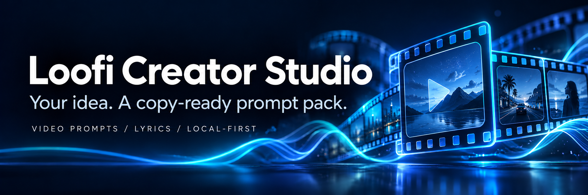
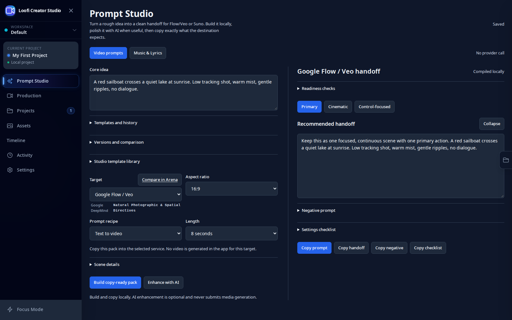
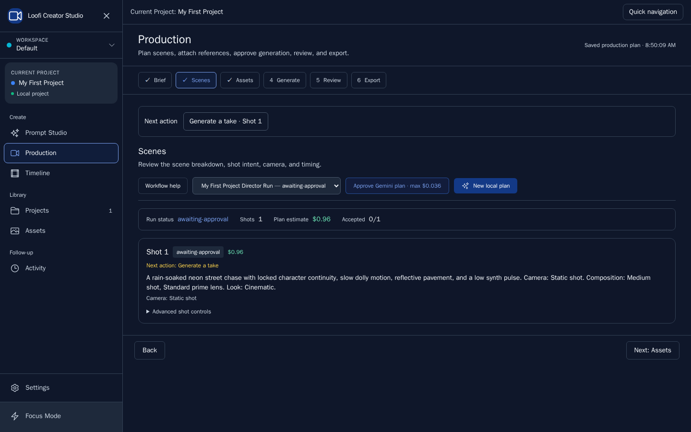
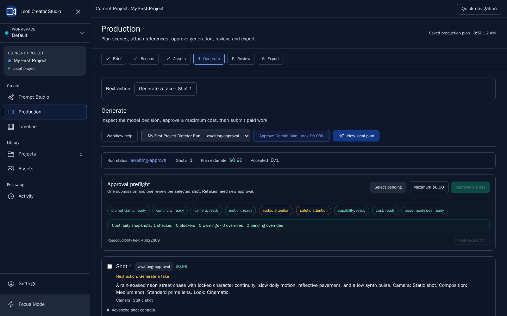
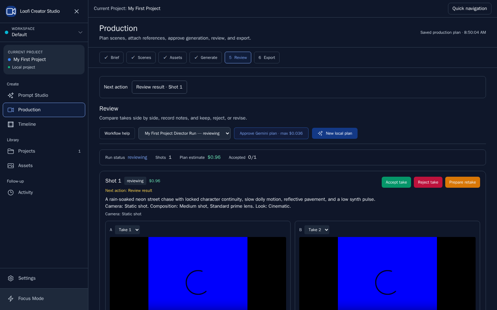

<p align="center">
  
</p>

# Loofi Creator Studio



<p align="center">
  <strong>Turn a scene idea into video prompts. Turn a song idea into a lyrics pack.</strong><br />
  A local-first desktop workspace for creators, with editable variants, model comparison and portable projects.
</p>

<p align="center">
  <a href="https://github.com/loofiboss-bit/Loofi-Veo-prompt-generator/releases/latest"><strong>Download</strong></a> ·
  <a href="docs/wiki/Home.md"><strong>Explore the wiki</strong></a> ·
  <a href="docs/wiki/Quick-Start.md"><strong>Quick start</strong></a> ·
  <a href="https://github.com/loofiboss-bit/Loofi-Veo-prompt-generator/issues">Report an issue</a>
</p>

[](https://github.com/loofiboss-bit/Loofi-Veo-prompt-generator/releases/latest)
[](https://github.com/loofiboss-bit/Loofi-Veo-prompt-generator/actions/workflows/validate.yml)
[](#install-v1410)
[](LICENSE)
[](https://github.com/loofiboss-bit/Loofi-Veo-prompt-generator/stargazers)
[](https://github.com/loofiboss-bit/Loofi-Veo-prompt-generator/forks)
[](https://github.com/loofiboss-bit/Loofi-Veo-prompt-generator/releases)

The download counter counts all release assets, including checksums and metadata; it is not a count
of unique users or installations.

## Why creators use it

| From your idea to…             | What you get                                                                          |
| ------------------------------ | ------------------------------------------------------------------------------------- |
| **A video prompt pack**        | One primary and two editable alternatives, with synchronized copy fields.             |
| **A model comparison**         | Compile the same brief for eight video targets in Arena before choosing your handoff. |
| **A Suno lyrics pack**         | Separate style and lyrics, section locks, and manual copy into Suno.                  |
| **A reusable workflow**        | Local templates, saved revisions, comparison and restore.                             |
| **A portable project**         | Export your project with referenced media, checksums and provenance.                  |
| **An approved production run** | Review supported Veo/Lyria requests and a maximum charge before submission.           |

Prompt compilation runs locally without a provider key. Optional AI enhancement requires Gemini
or Ollama. External generators have their own accounts, availability and pricing.

**Video targets:** Flow, Veo API, Kling, Runway, Sora, Luma, Wan and Hailuo.
**Music handoff:** Suno. Manual handoffs copy prompt text; they do not generate video in this app.

## Your first prompt in a minute

1. Open **Prompt Studio → Video** and describe the scene you want to create.
2. Choose a target, mode and duration; add references if needed.
3. Select **Build copy-ready pack**, review the three variants and edit the result.
4. Copy the pack into your chosen generator, or compare targets in **Arena**.

For music, switch to **Music & Lyrics**, build your pack and use **Copy Style** and **Copy Lyrics**
in Suno. Follow the [quick start](docs/wiki/Quick-Start.md) for the complete workflow.

## Inside Prompt Studio



_A real v14.1.0 browser capture with a fictional scene: local compilation, three variants,
revision tools and a ready-to-copy handoff. No provider key or generation request._

## Start here

| Goal                                              | Where to go                                               |
| ------------------------------------------------- | --------------------------------------------------------- |
| Build and edit video prompts                      | **Prompt Studio → Video** (`/studio`)                     |
| Prepare a Suno lyrics pack                        | **Prompt Studio → Music & Lyrics** (`/studio?mode=music`) |
| Create, open, import or export projects           | **Projects**                                              |
| Review and approve supported Veo/Lyria generation | **Production** (`/create`)                                |
| Configure an AI provider when needed              | **Settings**                                              |
| Inspect experimental capabilities                 | **Settings → Labs**                                       |
| Read the user guide                               | [docs/USER_GUIDE.md](docs/USER_GUIDE.md)                  |

The application ID remains `com.loofi.flowveostudio`. Existing local data and documented archive
schemas are preserved. Legacy routes `/director`, `/composer`, and `/optimize` redirect to `/create`.

## Prompt Studio

The workbench keeps the idea, basic settings and **Build copy-ready pack** together. Expand
**Templates and history** for Templates, Previous packs and Revisions; scene and music details
remain optional. Wide workspaces show editor and output side by side. Narrow workspaces use
**Editor / Result**, switching to Result when a pack is built. **Copy prompt** is the main action;
**Copy options** contains the other output formats.

The sidebar groups creation, libraries and follow-up. **Quick navigation** (Ctrl/Cmd+K) reaches
the same seven workspaces. Settings returns to the workspace you came from. Assets starts with
the media library; continuity profiles have their own tab. Reference and timeline controls open
the contextual asset drawer. See [the workbench design contract](DESIGN.md).

Describe your idea, choose the target, mode, duration and references, then select **Build copy-ready
pack**. Compilation runs locally. Each pack has three editable variants with synchronized copy
fields. Project history, version comparison and a complete local template library are available in Studio. Scene details and handoff notes
expand when needed.

Video targets Flow, Kling, Runway, Sora, Luma, Wan and Hailuo use manual copy handoffs. Suno uses **Copy Style**,
**Copy Lyrics**, **Copy All**, or **Copy & Open Suno**; it has no automated provider integration.
Only **Veo API** exposes an internal production handoff, with supported request combinations checked
before creating a plan. A plan does not submit a paid request: review its cost and approve it in
Production first.

Music templates are local lyric suggestions. AI enhancement requires a configured Gemini or Ollama
provider. Section rewriting keeps the requested language and preserves other sections, including
locks. Late AI responses are ignored after input changes.

Drafts, variant edits and section locks autosave after 500 ms to the active project document.
**Saving**, **Saved**, and **Not saved** report the real persistence result; memory fallback cannot
claim a durable save. Project switching waits for pending draft writes.

## New in v14.1.0

- **Compare in Arena** compiles all eight video targets from the same brief with the same compiler
  as Studio. Copy packages match Studio exactly; this is a prompt comparison, not a video-quality benchmark.
- **Readiness checks** distinguish documented constraints, writing advice and unconfirmed compatibility.
  Checks update after editing any variant; **Open control** selects the affected field or variant.
  Quoted dialogue is preserved. Manual copy remains available; internal Veo requests remain approval-gated.
- **Versions and comparison** saves both workspaces, outputs, variant selection and lyric locks in the
  project. Restore saves the current work before creating a restored version. Identical snapshots are deduplicated.
- AI enhancement and section rewriting propose changes for **Accept changes** or **Reject changes**.
  The draft stays unchanged until acceptance, locked sections stay byte-identical, and edits invalidate pending proposals.
- **Studio template library** saves complete video or music inputs for reuse between projects, with
  search, target filtering, preview, update and delete. Re-select images and clips in each project.
  Older video templates remain available as read-only entries.

Changing brief inputs keeps the previous output visible until rebuilding. Rebuild, model change,
template application, AI acceptance and restore require a durable checkpoint first; a storage failure
blocks replacement. Project archives retain revisions and their referenced local media. Creative Pack
schema 5 supports revisions without changing the documented project schema 11 or existing storage keys.

## Portable projects and production

Projects exposes creation, import and export directly. `.loofi-project` archives contain the chosen
project document, referenced local media, relative paths, checksums and provenance. Import assigns
consistent local IDs and revokes active cost approvals. Missing media blocks export instead of
producing an unusable archive.

Production retains its Brief → Scenes → Assets → Generate → Review → Export workflow. OTIO bundles
use actual timeline tracks, gaps, trims and selected takes with packaged media. FCPXML is experimental
until import into an external editor is qualified.

## Labs

Labs is off by default. Camera staging is a local preview experiment. ComfyUI diagnostics can be
opened after enabling Labs, but video rendering is unavailable. Live audio, LAN collaboration and
Foley generation have incomplete integrations and their actions are disabled. GPU rendering,
physical multi-device collaboration and external NLE imports are not qualified by mock tests.

See [v14 implementation notes](docs/V14_IMPLEMENTATION.md) for contracts and verification boundaries.

## Local-first safety

- Projects, prompt artifacts, history, settings, and media stay local by default.
- `PromptArtifactV1` keeps normalized input, one primary, two alternatives, validation, provenance,
  and byte-identical copy fields together.
- Gemini and Ollama optimization uses a structured JSON contract; invalid provider output leaves the
  local draft visible instead of silently falling back.
- Paid provider requests are fail-closed and require an explicit approval with a maximum charge.
- Desktop credentials stay in the operating-system vault and never enter renderer state.
- `.loofi-project` schema 11 and Creative Pack schema 5 preserve older project data and unknown fields.

## Install v14.1.0

Download the [v14.1.0 GitHub Release](https://github.com/loofiboss-bit/Loofi-Veo-prompt-generator/releases/tag/v14.1.0)
and verify the asset against `SHA256SUMS.txt` before installing.

### Windows

Use the NSIS installer (`Loofi-Flow-Veo-Studio-14.1.0-win-x64-setup.exe`) for a normal installation, or the portable EXE (`Loofi-Flow-Veo-Studio-14.1.0-win-x64-portable.exe`) without installation.

### Fedora RPM from GitHub

```bash
sudo dnf install ./Loofi-Flow-Veo-Studio-14.1.0-linux-x86_64.rpm
```

### Fedora COPR

```bash
sudo dnf copr enable loofitheboss/loofi-creator-studio
sudo dnf install veo-prompt-generator
```

The [COPR project](https://copr.fedorainfracloud.org/coprs/loofitheboss/loofi-creator-studio/)
publishes the Fedora 44 x86_64 package. Its source helper downloads the matching GitHub RPM and
checks `SHA256SUMS.txt` before COPR builds the package. The current package is
`14.1.0-2.fc44`; run `sudo dnf upgrade veo-prompt-generator` if an older package is
already installed.

### Linux AppImage

```bash
chmod +x Loofi-Flow-Veo-Studio-14.1.0-linux-x86_64.AppImage
./Loofi-Flow-Veo-Studio-14.1.0-linux-x86_64.AppImage
```

## Development

The current unreleased creator-flow additions connect manual Studio video results back to their
original prompt variants. Import a local video, confirm a manual review, and use it on a storyboard
scene and timeline. Production shows scene-specific next actions, recovery for known jobs, and
review sources and findings. Timeline and Production can export only the selected edit as an OTIO
delivery ZIP; complete `.loofi-project` backups remain separate and strict.

See [creator-flow contracts and verification](docs/CREATOR_FLOW.md). These local development changes
do not imply a new published installer or release.

Node.js 24 and npm are required.

```bash
nvm use
npm ci
npm run electron:dev
```

Useful checks:

```bash
npm run validate
npm run validate:release
npm run screenshots
```

## Documentation

- [Documentation portal](docs/README.md)
- [User guide](docs/USER_GUIDE.md)
- [Prompting guide](docs/wiki/Prompting-Guide.md)
- [Suno handoff](docs/wiki/Suno-Handoff.md)
- [Production workflow](docs/wiki/Production-Workflow.md)
- [Architecture](docs/ARCHITECTURE.md)
- [Release process and evidence](docs/RELEASE.md)
- [Installation and updates](docs/wiki/Installation-and-Updates.md)
- [Release notes](docs/wiki/Release-Notes.md)
- [Contributing](CONTRIBUTING.md)
- [Security policy](SECURITY.md)

## A look inside Production



_Production scene planning. These deterministic screenshots show the advanced workflow;
Prompt Studio is the copy-first starting point._

| Review before spending                                                          | Review your selected takes                                       |
| ------------------------------------------------------------------------------- | ---------------------------------------------------------------- |
|  |  |

The [screenshot guide](docs/wiki/Screenshots.md) explains how to regenerate the deterministic,
provider-free fixtures. The screenshots cover the advanced production workflow; Prompt Studio is the
copy-first entry point in the shipped application.

## Help shape the studio

Found a rough edge? [Report a bug](https://github.com/loofiboss-bit/Loofi-Veo-prompt-generator/issues/new/choose)
or suggest a workflow improvement. Contributions are welcome: start with
[CONTRIBUTING.md](CONTRIBUTING.md), the [architecture](docs/ARCHITECTURE.md) and the
[security policy](SECURITY.md). If the studio helps your workflow, a GitHub star helps others discover it.

MIT License — see [LICENSE](LICENSE). Independent project; not affiliated with Google or the other
model providers. Product names belong to their respective owners.
