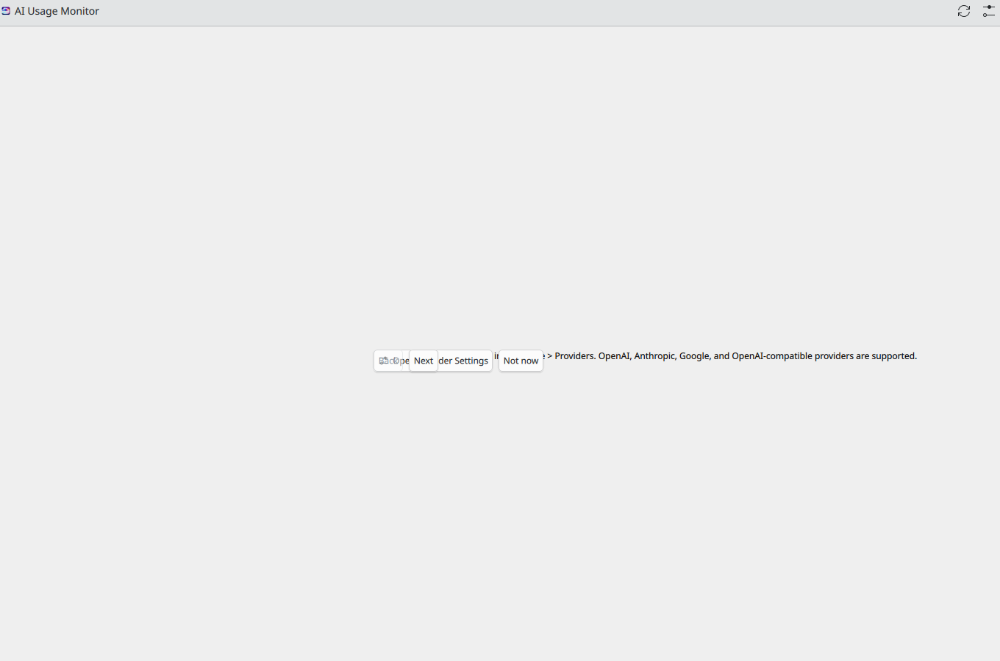
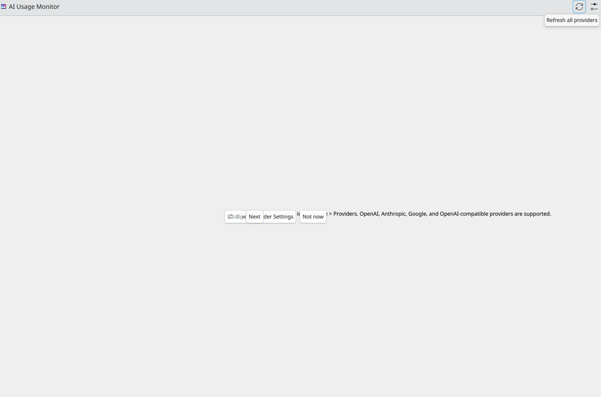

# Plasma AI Monitor Companion Guide

This guide documents how to run `plasma-ai-usage-monitor` as a companion tool in the Loofi
multi-repo workspace with Veo Studio.

## Scope

- `plasma-ai-usage-monitor` is a **desktop companion widget**
- It is **not** an HTTP service
- It should be managed as a sibling repository to `Loofi-Veo-prompt-generator`

## Workspace Layout

Use this sibling structure so shared workspace files resolve cleanly:

```text
~/Documents/
├── Loofi VEO/
│   └── Loofi-Veo-prompt-generator/
└── Loofi Projects/
    └── plasma-ai-usage-monitor/
```

If you use the provided workspace template, this entry is expected:

- Name: `Plasma AI Monitor`
- Path: `../plasma-ai-usage-monitor`

## Build and Run (Fedora KDE Plasma)

```bash
cd ~/Documents/"Loofi Projects"/plasma-ai-usage-monitor

sudo dnf install cmake extra-cmake-modules qt6-qtbase-devel qt6-qtdeclarative-devel \
  kf6-ki18n-devel kf6-kconfig-devel kf6-kcoreaddons-devel \
  plasma-workspace-devel

cmake -B build
cmake --build build
```

Optional install:

```bash
sudo cmake --install build
```

Direct run (development):

```bash
./build/bin/plasma-ai-usage-monitor
```

## Daily Workflow with Veo Studio

1. Start Veo Studio (`npm run dev` or desktop build)
2. Start `plasma-ai-usage-monitor` from its own repository
3. Use Veo for prompting, generation, editing, and export
4. Use the monitor as a desktop-side companion for local workspace observability tasks

## Networking and LAN Notes

- Do not allocate a LAN port for `plasma-ai-usage-monitor`
- Keep LAN routing focused on web/API services only:
  - Veo: `8080`
  - Suno: `18000`
  - Fedora Tweaks API: `18001`

## Troubleshooting

### Monitor does not build

- Verify Qt6/KF6 dev dependencies are installed
- Remove build cache and rebuild:

```bash
rm -rf build
cmake -B build
cmake --build build
```

### Monitor launches but Veo is unaffected

This is expected. The monitor is a separate desktop companion and does not inject into Veo runtime.

### Confusion about diagnostics

- Use **Veo Settings -> Diagnostics** for Veo app health
- Use Plasma monitor for desktop companion visibility

## App Reference Screenshots

Actual Plasma monitor UI captures:


_Main companion monitor window._


_Panel-oriented monitor capture._


_Monitor configuration/window reference._

## User Guide Route

Use these docs in order for the cleanest onboarding:

1. [Practical User Guide](./USER_GUIDE.md) for core product workflow
2. [Comprehensive User Guide](../USER_GUIDE.md) for full capability coverage
3. This companion guide for KDE Plasma monitor setup and behavior

## Related Docs

- [Workspace Setup](./WORKSPACE_SETUP.md)
- [Fedora Setup](./FEDORA_SETUP.md)
- [Workspace LAN Hosting](./WORKSPACE_LAN_HOSTING_192.168.1.3.md)
- [Practical User Guide](./USER_GUIDE.md)
- [Comprehensive User Guide](../USER_GUIDE.md)
