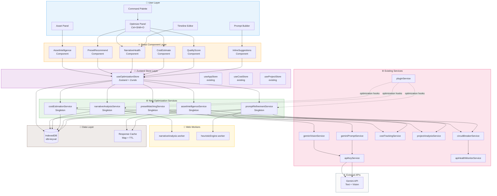

# Epic Architecture Specification: AI-Driven Project Optimization

## 1. Epic Architecture Overview

This epic introduces an **AI-powered optimization layer** into Veo Studio's existing service-driven architecture. The approach adds five new singleton services and one new Zustand store that integrate with the existing Gemini API client, cost tracking, project analysis, and plugin infrastructure. No architectural changes are required — the optimization layer follows the established `Service → Store → Component` data flow, persists all data locally via IndexedDB (`idb-keyval`), and degrades gracefully when the Gemini API is unavailable by falling back to local heuristic rule engines.

**Key architectural principles:**

- **Local-first**: All optimization data (suggestions, scores, analysis results) stored in IndexedDB. No server-side dependencies beyond the Gemini API.
- **Non-blocking**: All analysis runs asynchronously via debounced triggers and Web Workers for heavy computation (narrative analysis, cost modeling).
- **Composable**: Each optimization capability (prompt refinement, asset intelligence, cost estimation, narrative analysis, preset recommendation) is an independent service that can be used individually or composed via the Optimize panel.
- **Plugin-extensible**: Optimization hooks exposed through the existing plugin API contract (`StudioPlugin`), enabling community-built scoring rules and custom analyzers.

---

## 2. System Architecture Diagram

---

## 3. High-Level Features & Technical Enablers

### Features

| #   | Feature                           | Description                                                                                                                                                    | Primary Service            |
| --- | --------------------------------- | -------------------------------------------------------------------------------------------------------------------------------------------------------------- | -------------------------- |
| F1  | **Inline Prompt Refinement**      | Real-time, debounced Gemini-powered suggestions as users type in the Prompt Builder. Accept/dismiss/modify workflow with Zundo undo support.                   | `promptRefinementService`  |
| F2  | **Asset Intelligence**            | Auto-analyze uploaded images/video via Gemini Vision. Extract and display metadata (scene type, mood, subjects, color palette). Auto-populate timeline fields. | `assetIntelligenceService` |
| F3  | **Cost/Quality Estimation**       | Per-prompt quality scoring (1–10) and cost estimation for Flow/Veo. Trade-off visualization. Batch optimization.                                               | `costEstimationService`    |
| F4  | **Narrative Sequencing Analysis** | Multi-scene coherence analysis: detect missing transitions, pacing issues, character jumps. Scene reordering suggestions.                                      | `narrativeAnalysisService` |
| F5  | **Auto-Preset Recommendation**    | Analyze project complexity → recommend optimal model profile and export preset with reasoning.                                                                 | `presetMatchingService`    |
| F6  | **Optimize Panel**                | Unified panel (sidebar + `Ctrl+Shift+O`) aggregating all optimization features with batch apply.                                                               | React component layer      |
| F7  | **Optimization History**          | Persistent log of all accepted/dismissed suggestions per project for learning and audit.                                                                       | `useOptimizationStore`     |
| F8  | **Plugin Optimization Hooks**     | Expose `onPromptAnalysis`, `onScoreCalculation`, `onNarrativeCheck` hooks via Plugin API.                                                                      | `pluginService` extension  |

### Technical Enablers

| #    | Enabler                                                | Justification                                                                                                                                                                     |
| ---- | ------------------------------------------------------ | --------------------------------------------------------------------------------------------------------------------------------------------------------------------------------- |
| TE1  | **`promptRefinementService`** (new singleton)          | Encapsulates Gemini prompt analysis, debouncing, suggestion lifecycle, and heuristic fallback. Depends on `geminiPromptService` and `circuitBreakerService`.                      |
| TE2  | **`assetIntelligenceService`** (new singleton)         | Wraps Gemini Vision for media analysis, tag extraction, and metadata mapping. Depends on `geminiVisionService`.                                                                   |
| TE3  | **`costEstimationService`** (new singleton)            | Extends existing `costTrackingService` with per-prompt quality scoring, model-specific cost modeling, and trade-off calculations.                                                 |
| TE4  | **`narrativeAnalysisService`** (new singleton)         | Scene graph construction, transition detection, pacing analysis. Offloads heavy computation to a Web Worker (`narrativeAnalysis.worker`).                                         |
| TE5  | **`presetMatchingService`** (new singleton)            | Rule-based matching engine that analyzes prompt complexity vectors against model capability profiles.                                                                             |
| TE6  | **`useOptimizationStore`** (new Zustand + Zundo store) | Centralized state for suggestions, scores, analysis results, and optimization history. Persisted via `idbStorage`. `partialize` scopes undo to suggestion accept/dismiss actions. |
| TE7  | **`narrativeAnalysis.worker`** (new Web Worker)        | Offloads computationally expensive scene graph analysis off the main thread. Communicates via structured `postMessage`.                                                           |
| TE8  | **`heuristicEngine.worker`** (new Web Worker)          | Runs local scoring rules when Gemini API is unavailable. Pattern matching, keyword density, structural completeness checks.                                                       |
| TE9  | **Gemini Response Cache** (in-memory Map + TTL)        | Deduplicates identical analysis requests within a session. 5-minute TTL. Reduces API costs and latency.                                                                           |
| TE10 | **Plugin API extension**                               | Add `optimization` namespace to existing `PluginAPI` interface with typed hook registration.                                                                                      |
| TE11 | **i18n namespace `optimization`**                      | New translation namespace for all optimization panel strings (EN + AR).                                                                                                           |

---

## 4. Technology Stack

| Layer                | Technology                                          | Purpose                                                                              |
| -------------------- | --------------------------------------------------- | ------------------------------------------------------------------------------------ |
| **UI Framework**     | React 18 + TypeScript (strict)                      | Functional components, `React.lazy` + `Suspense` for Optimize panel                  |
| **State Management** | Zustand + Zundo                                     | `useOptimizationStore` with temporal middleware, `partialize` for selective undo     |
| **Persistence**      | IndexedDB via `idb-keyval`                          | Local-first storage for suggestions, scores, analysis history                        |
| **AI Integration**   | Gemini API (Text + Vision)                          | Prompt refinement, asset tagging, quality scoring                                    |
| **API Resilience**   | `circuitBreakerService` + `apiHealthMonitorService` | Graceful degradation, automatic fallback to heuristic engine                         |
| **Concurrency**      | Web Workers                                         | `narrativeAnalysis.worker`, `heuristicEngine.worker` for off-main-thread computation |
| **Build**            | Vite 7 + code splitting                             | Optimization route and export-heavy chunks in rollup manual chunks config            |
| **Desktop**          | Electron 40                                         | Native keyboard shortcuts, file system access for asset analysis                     |
| **Testing**          | Vitest + @testing-library/react + jsdom             | Co-located test files, `vi.mock` for service mocking                                 |
| **i18n**             | i18next                                             | New `optimization` namespace, Arabic RTL support                                     |
| **Accessibility**    | ARIA attributes + keyboard navigation               | Full panel keyboard accessibility per NFR-05                                         |
| **Plugin System**    | Existing `pluginService` + sandbox                  | Extended with optimization hook types                                                |

---

## 5. Technical Value

**Value: High**

**Justification:**

- **Zero architectural risk** — All new code follows the established singleton service + Zustand store + React component pattern. No new frameworks, databases, or infrastructure required.
- **Leverages existing investment** — Directly reuses `geminiPromptService`, `geminiVisionService`, `costTrackingService`, `projectAnalysisService`, `circuitBreakerService`, and the plugin sandbox. Estimated 40% of the service integration is already built.
- **Web Worker offloading** — Narrative analysis and heuristic fallback run off-main-thread, preserving UI responsiveness and meeting the < 100ms startup impact requirement (NFR-07).
- **Plugin API extensibility** — The optimization hooks create a new category of community plugins (custom scoring rules, domain-specific analyzers) that increase platform value without core team effort.
- **Local-first integrity** — All optimization data stays in IndexedDB, consistent with the app's privacy-first architecture. No new server dependencies.

---

## 6. T-Shirt Size Estimate

**Size: L (Large)**

| Component                     | Effort       | Notes                                                                                       |
| ----------------------------- | ------------ | ------------------------------------------------------------------------------------------- |
| 5 new services                | Medium       | Follow established singleton pattern; heavy Gemini integration logic                        |
| 1 new Zustand store           | Small        | Standard pattern with Zundo + persist                                                       |
| 2 new Web Workers             | Small–Medium | Structured message passing, heuristic rule engine                                           |
| 6 new React components        | Medium       | Optimize panel, inline suggestions, quality scores, cost viz, narrative health, preset reco |
| Plugin API extension          | Small        | Add typed hooks to existing PluginAPI interface                                             |
| i18n (EN + AR)                | Small        | ~80–120 new translation keys                                                                |
| Tests (services + components) | Medium       | ~15–20 new test files meeting coverage thresholds                                           |
| Integration & polish          | Medium       | Keyboard shortcuts, command palette, debounce tuning, cache management                      |

**Rationale:** The scope covers 5 distinct but interconnected features with significant AI integration complexity (Gemini prompt analysis, vision API, heuristic fallback). The architecture is well-defined and risk-free, but the breadth of UI, service, worker, and plugin work places this firmly at **L**, not XL — because the existing service infrastructure (Gemini client, cost tracking, project analysis, circuit breaker) eliminates approximately 40% of the integration effort that would otherwise be required.

---

_Generated: 2026-02-18 | Status: Draft | Input: Epic PRD (AI-Driven Project Optimization)_
_Next Step: Feature PRD breakdown via `breakdown-feature-prd`_
