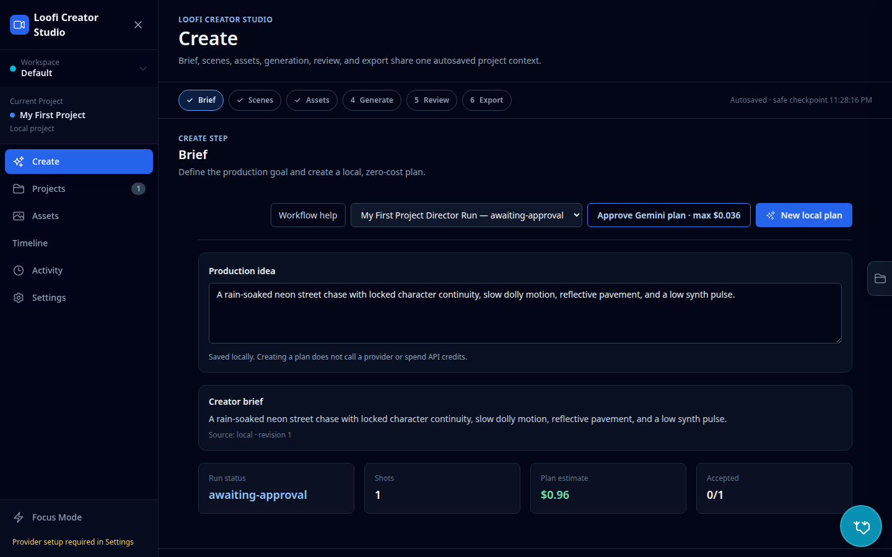
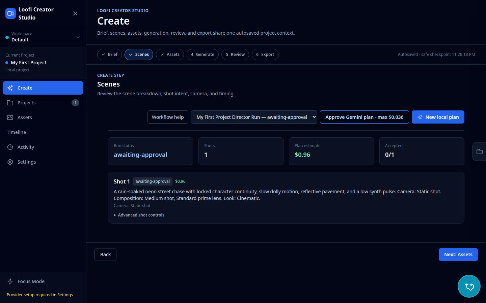
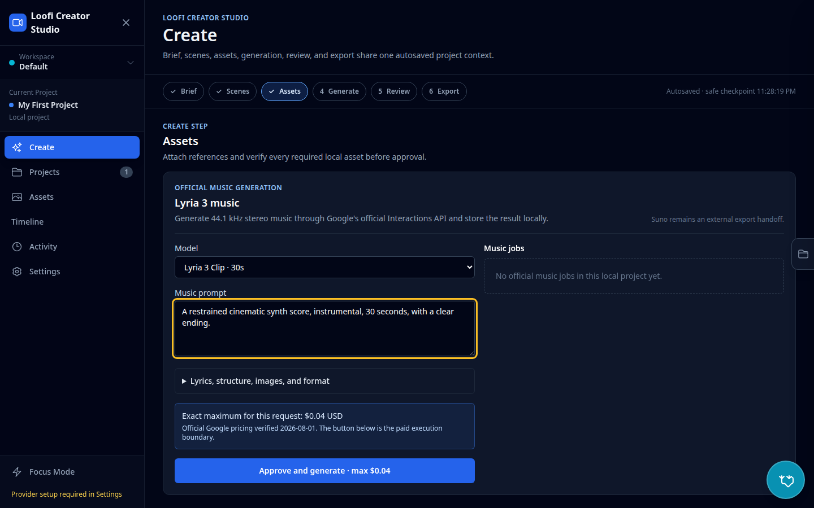
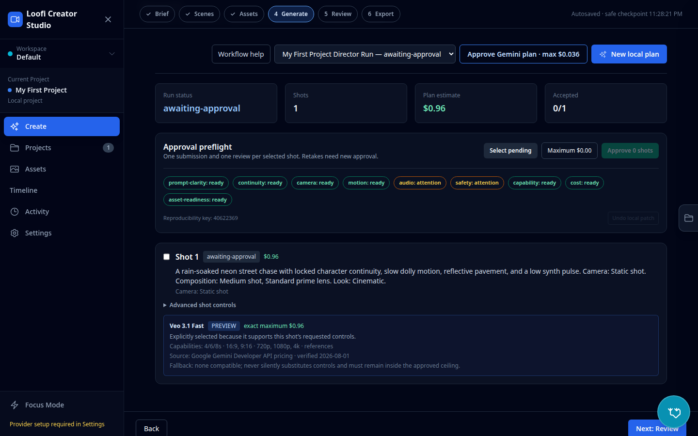
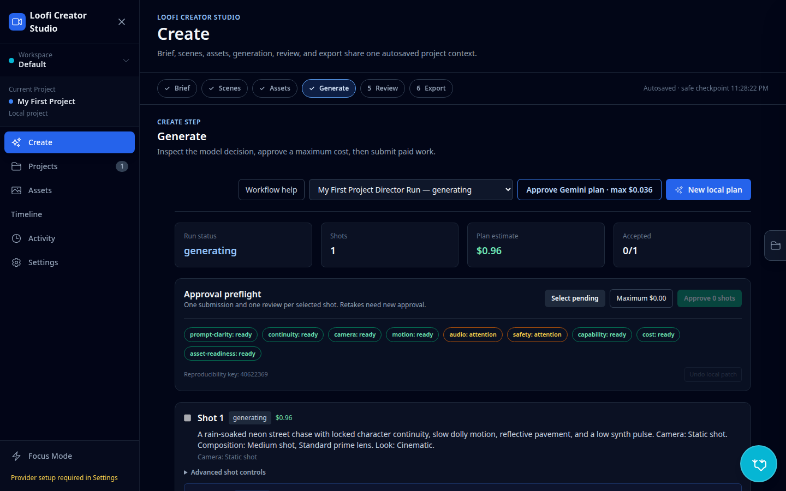
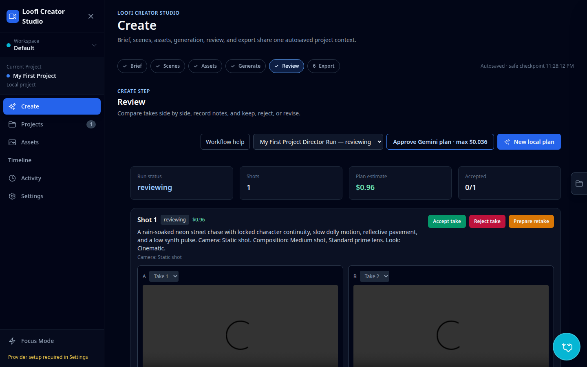
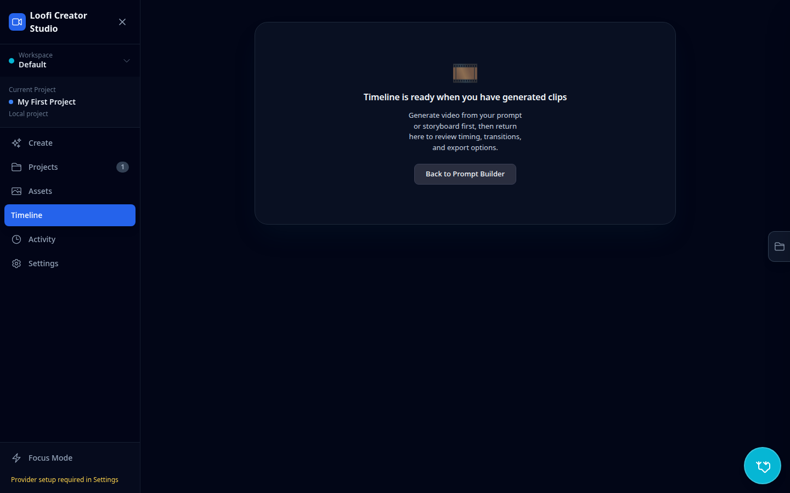
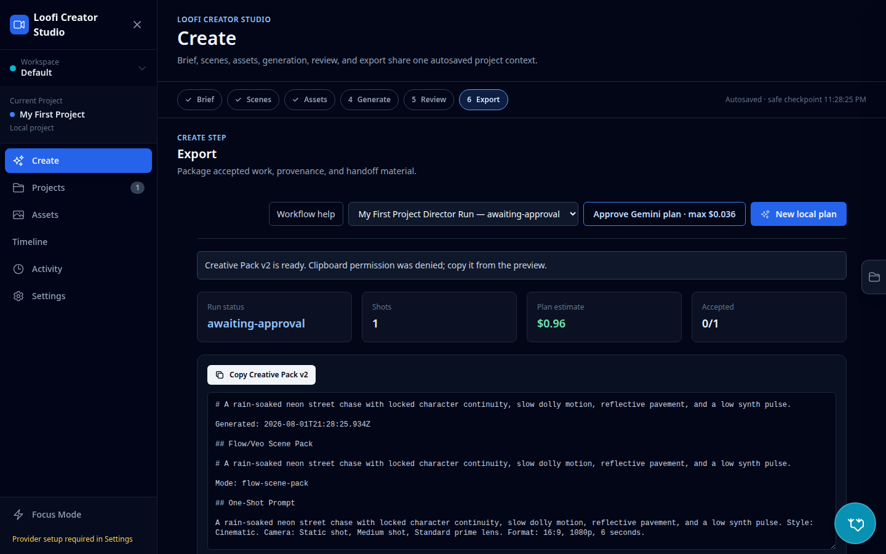
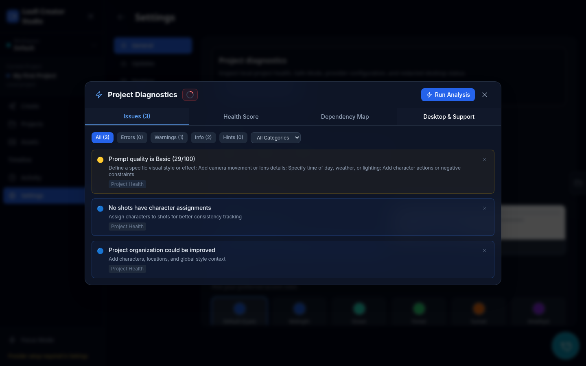

# Screenshots

These v11 screenshots use deterministic local fixtures and fake providers. They contain no provider
credentials and make no paid calls.











Regenerate and verify them with:

```bash
npm run screenshots
```
