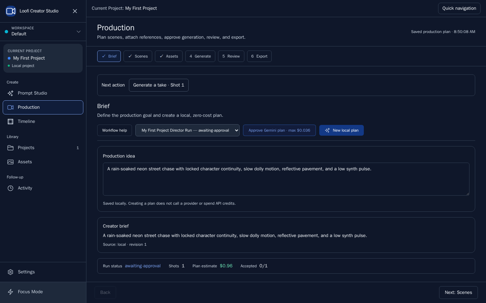
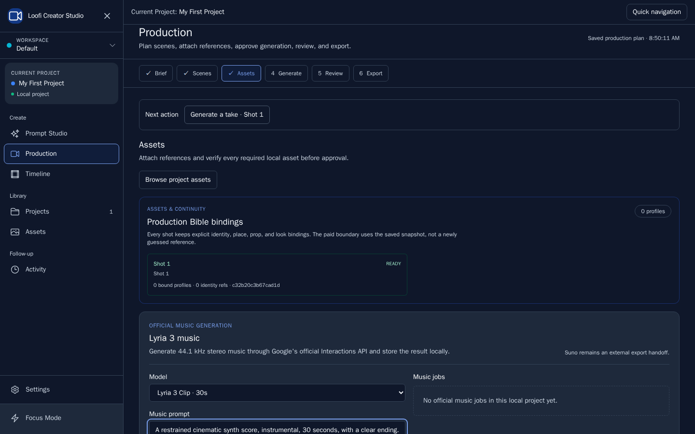
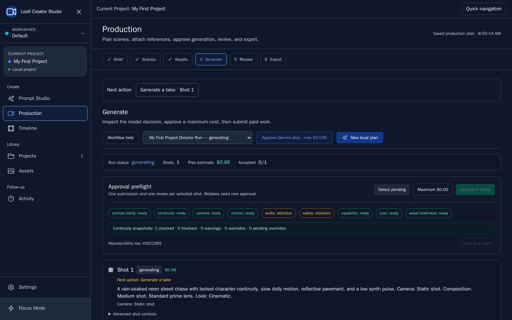
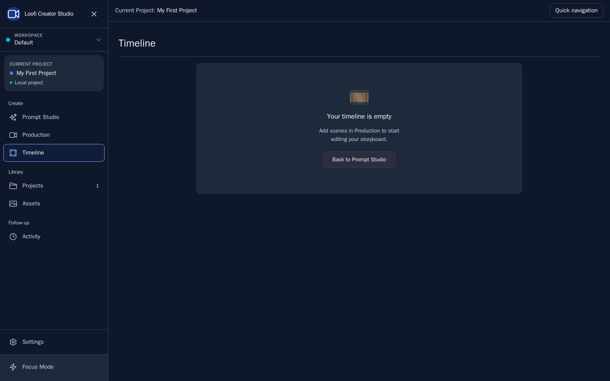
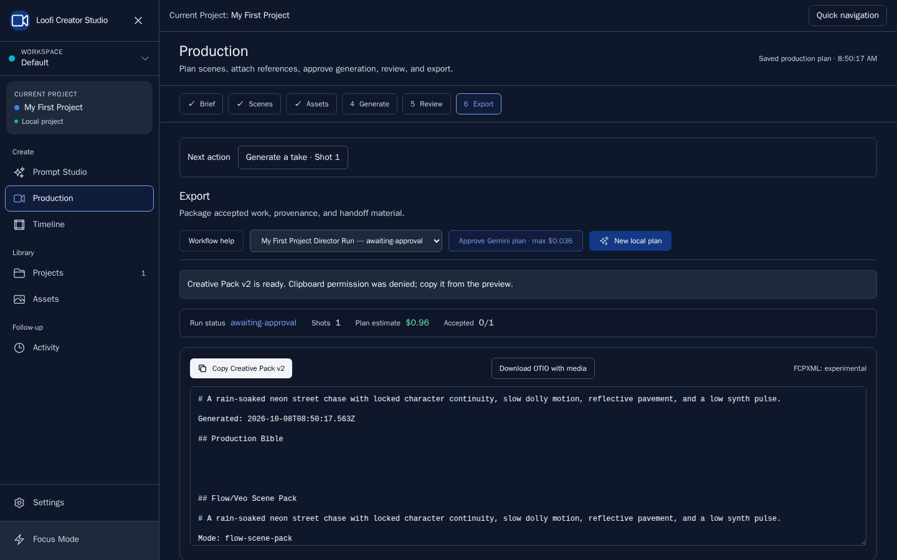
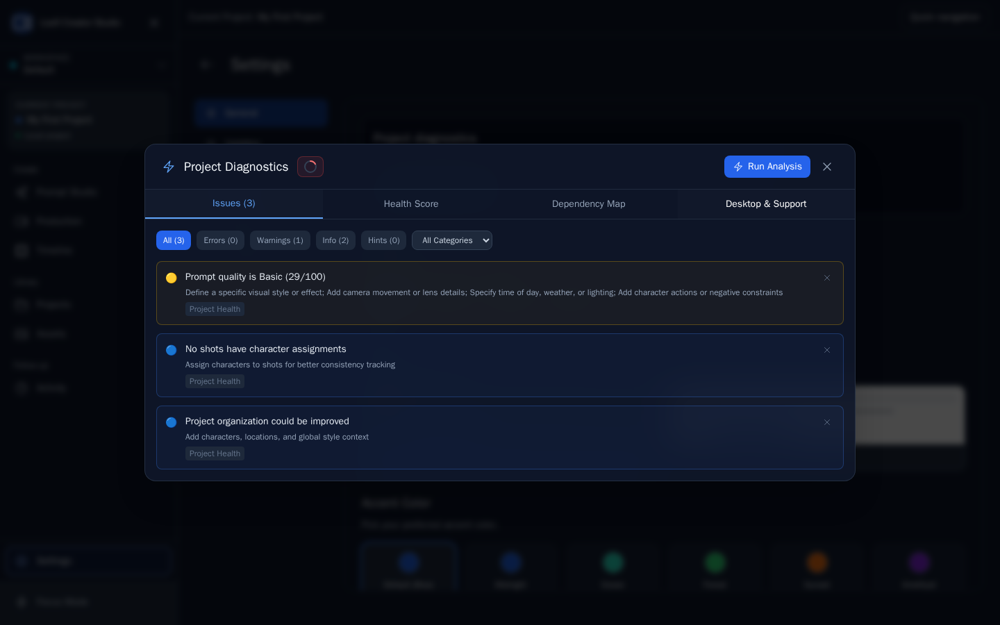

# Screenshots

## Prompt Studio — v14.1.0


A real browser capture with a fictional sailboat brief, dark theme and no configured provider.
It shows local compilation, editable variants, revision tools and copy controls. Recreate it with the
[Prompt Studio capture instructions](../../assets/screenshots/README.md#prompt-studio-v1410).

## Production fixtures

These earlier v11 Production screenshots use deterministic local fixtures and fake providers.
They contain no provider credentials and make no paid calls.











Regenerate and verify the Production fixtures with:

```bash
npm run screenshots
```
